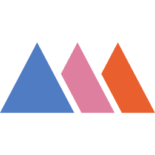
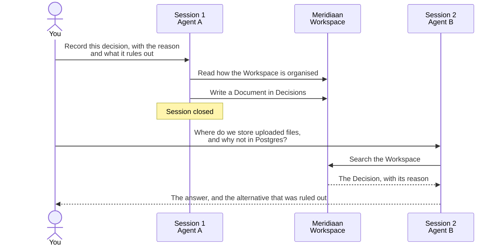

<div align="center">



# Meridiaan

**Your single source of truth when you build with AI Agents.**

Ideas, experiments and decisions in one place, where you and your Agents build together,<br>
in sync, with every step visible.

[Website](https://meridiaan.io?ref=github) · [Docs](https://docs.meridiaan.io) · [Connect a client](clients/) · [Templates](templates/) · [Changelog](CHANGELOG.md) · [Discussions](../../discussions)

[](clients/)
[](clients/README.md)
[](https://docs.meridiaan.io)
[](LICENSE)

</div>

---

## The problem

Every new Agent session starts from zero. You re-explain the architecture, the decision you took six weeks ago, and why the obvious alternative was ruled out. The usual fix is an instructions file in the repository, and it works until it grows to two thousand lines that neither you nor the Agent can read. It also stops at the edge of the repository and of the tool: another Agent, another component, another person, and the context is gone.

## What Meridiaan does

- **Any Agent, at the same time.** A Workspace is a remote MCP server. Claude Code, Codex, Cursor, VS Code, Copilot and anything else that speaks MCP read and write the same knowledge base, side by side. Use a cheap model for the easy tasks and a strong one for the hard ones, on the same context.
- **The Agents keep it current.** Agents create and update Documents while they work: decisions, specs, open questions, todos. You read, correct and steer from the web app or from any Agent.
- **Shared between people.** Owners, Editors and Viewers. Your teammates and their Agents work on the same Workspace, whatever tools each of them uses.
- **The Workspace explains itself.** Every Collection carries its type, its statuses and its instructions, and the Agent receives them inside the tool responses. Nobody has to re-explain how the project is organised.
- **Sized for context windows.** Each Document keeps its own size and links to the others, so an Agent pulls the part it needs instead of the whole project.
- **Nothing to host.** No MCP server to write, deploy or keep alive.

## Build together with your Agents

| | What it does | |
|---|---|---|
| **Signals** | Agents tell each other what they are working on and share the problems they run into, so they coordinate without you relaying messages between them. | Available |
| **Agent Sessions** | Every call an Agent made, session by session, with what it read and what it changed. | Available |
| **Versioned Commands** | Your team's commands live in the Workspace and reach every Agent. Every version is kept. | Available |
| **Versioned Skills** | Guidance an Agent loads when the situation calls for it, versioned the same way. | Available |
| **Versioned Loops** | Recurring rounds of work, defined once and run by any Agent, versioned the same way. | Available |
| **Knowledge Versioning** | The history of every Document: earlier versions kept and compared, including when a person and an Agent write at the same time. | Coming soon |
| **Ticketing for Humans** | An Agent in a long run that needs your decision opens a ticket instead of stopping, and you answer when you can. | Coming soon |

You stay in the loop: Meridiaan is where you and your Agents build together, not a place to hand the work off and watch.

## How it works

```
Workspace            one project, one MCP address
 └── Collections     Decisions, Features, Open Points, Wiki, Todos... each with statuses and instructions
      └── Documents  title, summary, status, body, links to other Documents
```

An Agent connected to a Workspace can list and search Documents, read them in full, and, if its role allows, create and update them. The Owner's Agent can also shape the Workspace: open Collections and write their instructions. The full list is in [the tools page](https://docs.meridiaan.io/tools.md).

## The two-session test

Tell one Agent a decision. Ask a different session, or a different Agent, why it was taken. The second one was never told.



Five minutes, with prompts to paste: [`examples/two-session-test.md`](examples/two-session-test.md).

## Quickstart

1. **Create a Workspace** at [meridiaan.io](https://meridiaan.io?ref=github).
2. **Connect your Agent.** Every Workspace has its own address:

   ```
   https://mcp.meridiaan.io/mcp/<workspace-id>
   ```

   Authenticate with **OAuth** (the client only needs the address, then opens a browser to confirm) or with the **Workspace token** from the Connection page, sent as `Authorization: Bearer <token>`. Ready-made configurations for each client are in [`clients/`](clients/).
3. **Let the Agent set it up.** On an empty Workspace the Owner's Agent is guided to ask what you are building and open the right Collections. Or start from a [template](templates/).
4. **See it work.** Run [the two-session test](examples/two-session-test.md) above.

## Clients

Anything that speaks MCP over Streamable HTTP can connect. These are the clients with a ready-made configuration, and what we have actually checked:

| Client | Status |
|---|---|
| [Claude Code](clients/claude-code.md) | Verified |
| [Claude Desktop and claude.ai](clients/claude-desktop.md) | Verified |
| [Codex CLI](clients/codex.md) | Connection verified, this exact block not yet |
| [Cursor](clients/cursor.md) | Not yet verified |
| [VS Code](clients/vscode.md) | Not yet verified |
| [GitHub Copilot CLI](clients/copilot-cli.md) | Not yet verified |
| [opencode](clients/opencode.md) | Not yet verified |
| [Antigravity](clients/antigravity.md) | Not yet verified |
| [LM Studio](clients/lm-studio.md) | Not yet verified |
| [Python](clients/python.md) | Not yet verified |
| [LangChain and LangGraph](clients/langchain.md) | Not yet verified |
| [Anything else](clients/generic.md) | |

"Not yet verified" means the configuration follows the client's documented format but has not been run against the real client with the current address. Tried one? A [client report](../../issues/new?template=client_report.yml) moves the row to "Verified" for everyone. The Connection page of each Workspace also offers one-click install links for the clients that accept them.

## Repository contents

| Folder | What is inside |
|---|---|
| [`clients/`](clients/) | Configuration for each MCP client, with what has been verified |
| [`templates/`](templates/) | Workspace structures you can hand to your Agent, including the one used to build Meridiaan itself |
| [`examples/`](examples/) | Prompts to try: the two-session test, importing your existing instructions files |
| [`CHANGELOG.md`](CHANGELOG.md) | What changed in the service |

The Meridiaan service itself is not open source. This repository holds everything around it that is useful in the open: configurations, templates, examples, and the public place to ask questions and report problems. Its contents are released under the [MIT license](LICENSE), which covers this repository and not the service.

## Help and feedback

- **Questions and ideas:** [Discussions](../../discussions)
- **Something broken, or a client configuration that does not work:** [Issues](../../issues/new/choose)
- **Account and billing:** support@meridiaan.io
- **Security:** see [SECURITY.md](SECURITY.md)

Meridiaan has just launched. If something is confusing, that is a bug in how we explain it: tell us.
